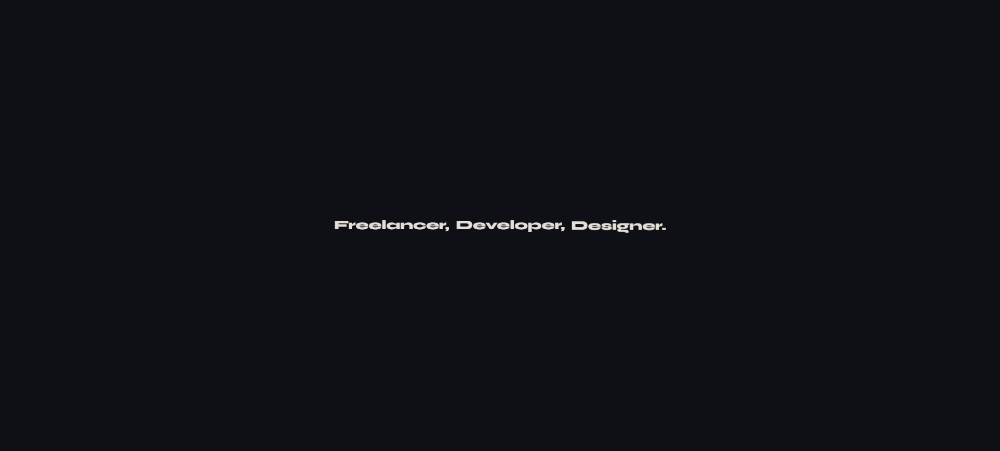
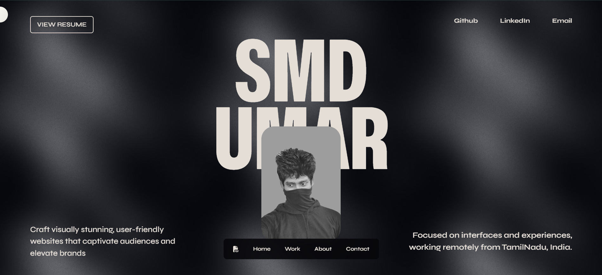
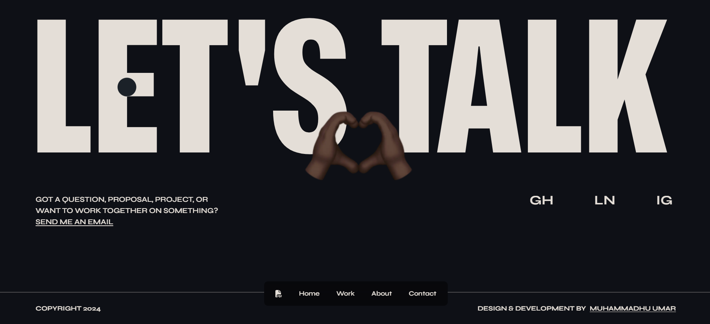

# Personal Portfolio Website — v1

My name is Muhammadhu Umar, and I’m a front-end engineer and product designer based in Tamilnadu, India. My passion lies in creating software that solves real-world problems and positively impacts people’s lives.

this website is to showcase my work. I’m always striving to create something unique and innovative. I love experimenting with new technologies and staying up-to-date with the latest trends in the tech world.

## Tech Stack

**Client:** React, Next.js, TypeScript, TailwindCSS, Framer Motion, GSAP.

## Screenshots & Demo








[View Live Demo](https://smdumar.netlify.app/)

## Run Locally

Clone the project

```bash
  git clone https://github.com/smdumar/Personal-Portfolio
```

Install dependencies

```bash
  npm install
```

Start the server

```bash
  npm run dev
```
